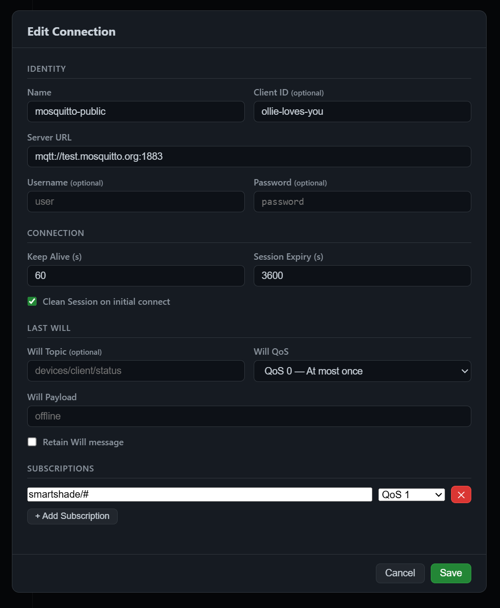
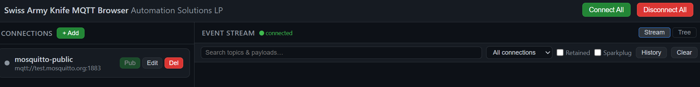
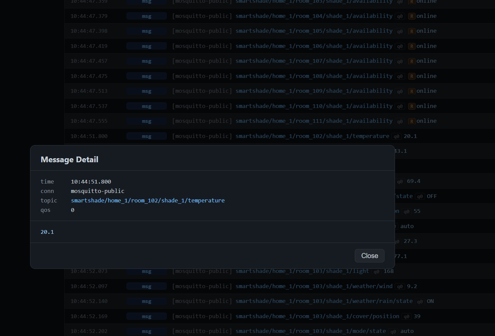
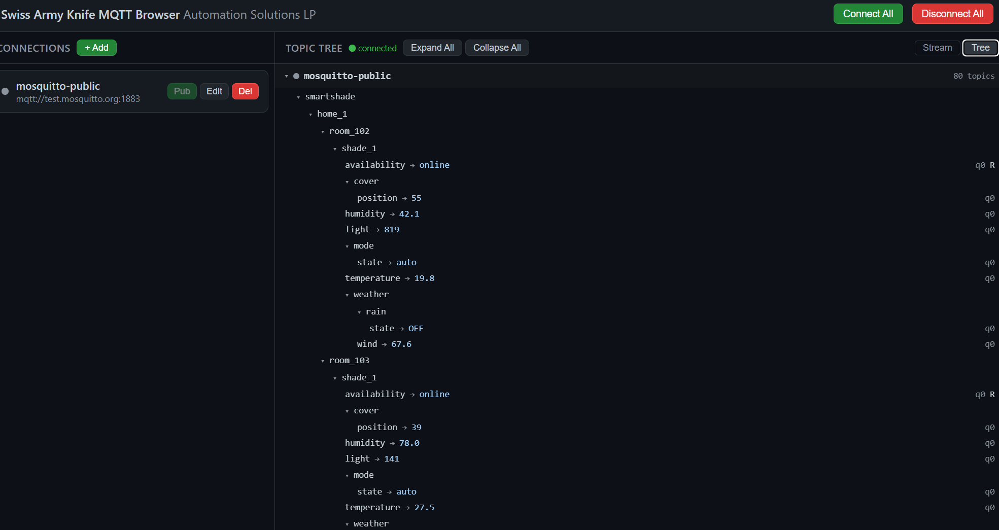

# swarmy-mqtt
Swiss Army Knife MQTT Browser

A web-based MQTT v5 client tool well suited for tracking clusters.

## How to
$ go build -o ./build/

$ cd build

$ ./swarmy-mqtt -h

$ ./swarmy-mqtt -state ./conns.json -db ./msgs.sqlite

Append the -port PORTNUM argument if you want to use a different port than 6080.

Browse to http://localhost:6080 or http://YOURIP:6080 and connect to 1 or more brokers at the same time.

Add a connection ...

And either click the circle adjacent to the name you provided or client Connect All to connect to your (broker/brokers).

You may click on a message for details.

Toggle Tree for a tree view or Stream for a stream view in the top right corner.

