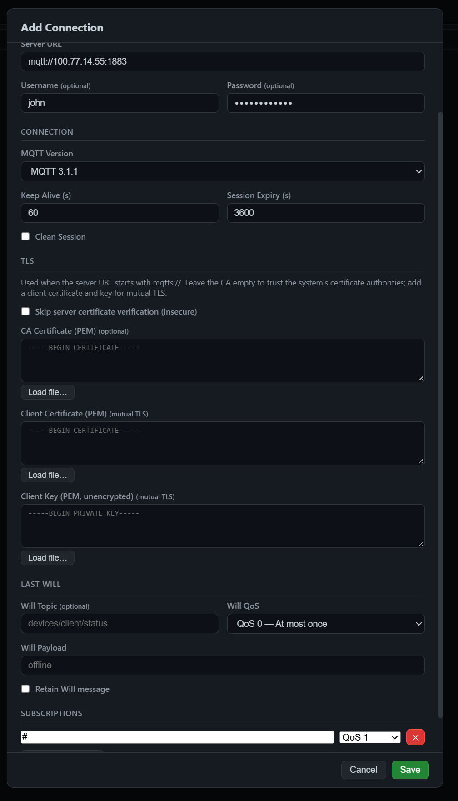
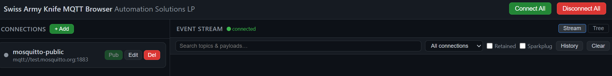
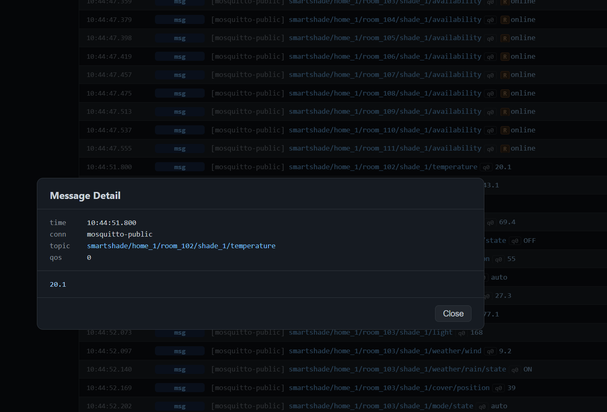
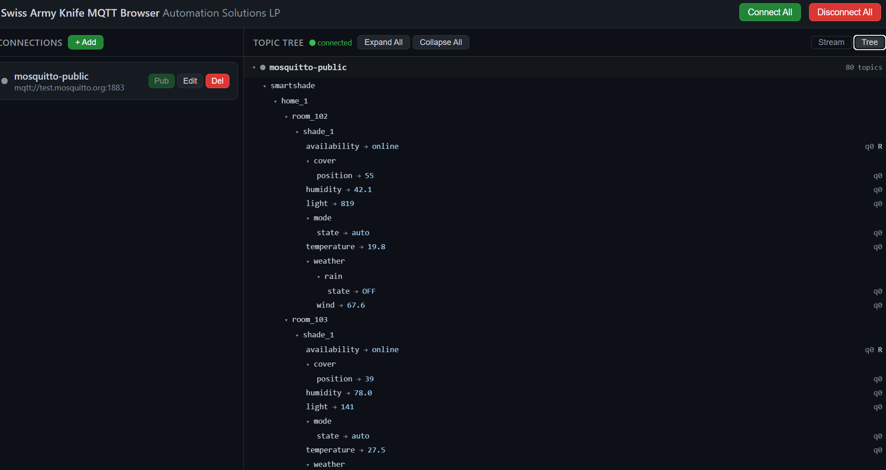

# swarmy-mqtt
Swiss Army Knife MQTT Browser

A web-based MQTT v5 and v3.1.1 client tool well suited for tracking clusters.

## How to
$ go build -o ./build/

$ cd build

$ ./swarmy-mqtt -h

$ ./swarmy-mqtt -state ./conns.json -db ./msgs.sqlite

Append the -port PORTNUM argument if you want to use a different port than 6080.

Browse to http://localhost:6080 or http://YOURIP:6080 and connect to 1 or more brokers at the same time.

Add a connection ...

And either click the circle adjacent to the name you provided or client Connect All to connect to your (broker/brokers).

You may click on a message for details.

Toggle Tree for a tree view or Stream for a stream view in the top right corner.

## TLS

Use an `mqtts://` server URL (default port 8883) to connect over TLS. In the connection's TLS section you can:

- paste or load a CA certificate (PEM) to trust a private CA; leave it empty to use the system's trusted CAs,
- add a client certificate and unencrypted private key (PEM) for mutual TLS,
- tick "Skip server certificate verification" for brokers with self-signed certificates (insecure).

With `-state`, connection settings, including passwords and TLS private keys, are saved in plain text in the state file (created with owner-only permissions, 0600). Keep it somewhere private.